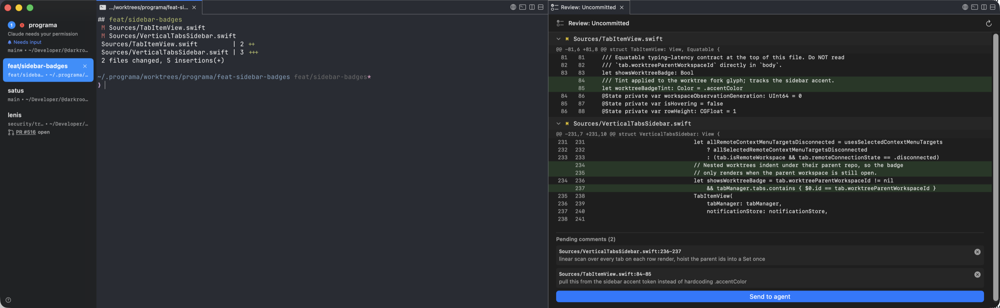

<h1 align="center">Programa</h1>
<p align="center">The open source terminal built for coding agents. Native macOS, powered by Ghostty.</p>

<p align="center">
  <a href="https://github.com/darkroomengineering/programa/releases/latest/download/programa-macos.dmg">
    
  </a>
</p>

<p align="center">
  <a href="https://x.com/darkroomengineering"></a>
  <a href="https://darkroom.engineering"></a>
  <a href="https://github.com/darkroomengineering/programa"></a>
</p>

<p align="center">
  
</p>

<p align="center">
  <a href="https://www.youtube.com/watch?v=i-WxO5YUTOs">▶ Demo video</a>
</p>

Run many coding agents in parallel and always know which one needs you.

- **Notifications built for agents** — a waiting agent's pane gets a ring, its tab lights up, and ⌘⇧U jumps to the latest unread. Wired for Claude Code, Codex, and OpenCode out of the box.
- **Vertical tabs** — the sidebar shows git branch, PR status, working directory, listening ports, and the latest notification for every workspace.
- **Splits and instant agents** — ⌘D / ⌘⇧D to split, ⌘⇧C boots a Claude Code workspace, `programa claude-teams` runs teammate mode as native splits.
- **In-app browser** — split a scriptable browser next to your terminal; agents can snapshot the page, click, fill forms, and evaluate JS against your dev server.
- **SSH workspaces** — `programa ssh user@remote`; browser panes route through the remote network so localhost just works.
- **Scriptable everything** — a CLI and socket API for workspaces, splits, keystrokes, and the browser.
- **Native and fast** — Swift/AppKit with libghostty rendering, no Electron. Reads your existing `~/.config/ghostty/config` for themes, fonts, and colors.

## Install

<a href="https://github.com/darkroomengineering/programa/releases/latest/download/programa-macos.dmg">
  
</a>

or

```bash
brew tap darkroomengineering/programa
brew install --cask programa
```

Programa auto-updates: every commit on `main` that passes CI ships automatically as the latest release. On relaunch it restores layout, directories, scrollback, and browser state — not live processes (yet).

## Why

Running many agents in Ghostty splits, the problem was never the terminal — it was knowing which agent needed me. Native notifications all say "waiting for your input" with no context, and GUI orchestrators lock you into their workflow (and Electron).

Programa is a primitive, not a solution: a terminal, a browser, notifications, workspaces, and a CLI to control all of it. It doesn't prescribe how to work with agents — what you build with the primitives is yours.

## Shortcuts

⌘⇧P opens the command palette, which lists every action. Full reference: [docs/keyboard-shortcuts.md](docs/keyboard-shortcuts.md) — everything is editable in `Settings → Keyboard Shortcuts`.

## Agent skill

Agents running inside programa (Claude Code, Codex, OpenCode) can drive the app itself — split panes, read a sibling pane's output, spawn and coordinate a helper agent — without stealing your focus. `programa claude/codex/opencode install-integration` installs [`SKILL.md`](SKILL.md) alongside the existing hooks; see [docs/agent-skill.md](docs/agent-skill.md) for the full walkthrough.

## Community

[darkroom.engineering](https://darkroom.engineering) · [Issues](https://github.com/darkroomengineering/programa/issues) · [Discussions](https://github.com/darkroomengineering/programa/discussions) · [@darkroomengineering](https://x.com/darkroomengineering)

## License

[GPL-3.0-or-later](LICENSE). Programa began as a GPL fork of [cmux](https://github.com/manaflow-ai/cmux) by Manaflow, Inc.; modifications © Darkroom Engineering.
