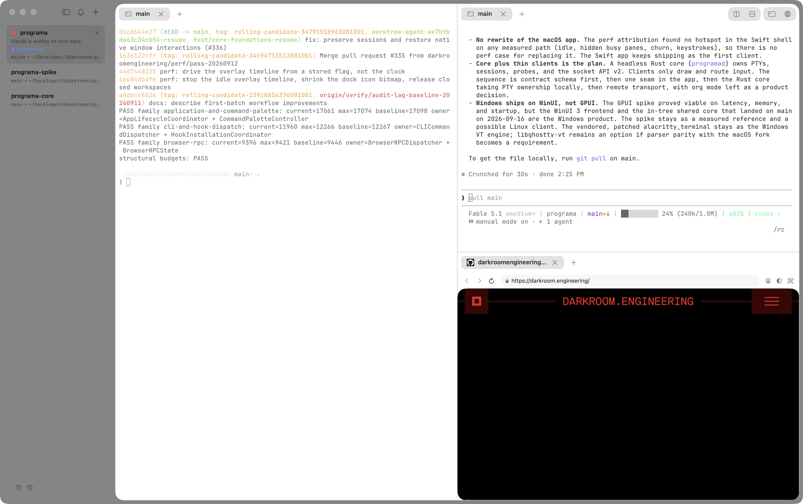

<h1 align="center">Programa</h1>
<p align="center">The open source terminal built for coding agents. Native macOS, powered by Ghostty. Native Windows frontend in development.</p>

<p align="center">
  <a href="https://github.com/darkroomengineering/programa/releases/latest/download/programa-macos.dmg">
    
  </a>
  <a href="#windows-preview">Windows development status</a>
</p>

<p align="center">
  <a href="https://x.com/darkroomdevs"></a>
  <a href="https://darkroom.engineering"></a>
  <a href="https://github.com/darkroomengineering/programa"></a>
</p>

<p align="center">
  
</p>

<p align="center">
  <a href="https://www.youtube.com/watch?v=i-WxO5YUTOs">▶ Demo video</a>
</p>

Run many coding agents in parallel and always know which one needs you.

The features below describe the macOS app. A native Windows frontend using
WinUI 3 is in development, with shared core behavior and platform-native UI.
See [Windows support](#windows-preview) and the
[Windows testing guide](docs/windows-testing.md).

- **Agent status, always visible.** Every workspace shows working, blocked, or idle. Claude Code, Codex, and OpenCode report it directly; agents without hooks (Gemini CLI, Copilot CLI, Cursor Agent, Aider) get it from reading the terminal screen against patterns you can override in `~/.config/programa/agent-detection/`.
- **Notifications built for agents.** A waiting agent's pane gets a ring, its tab lights up, and ⌘⇧U jumps to the latest unread.
- **Vertical workspace sidebar.** Git branch, PR status, working directory, listening ports, and the latest notification for every workspace, at a glance.
- **Diff review panel.** Split a review panel beside an agent's terminal, comment on the diff, and send the comments straight into the agent's input. It refreshes itself when the agent goes idle.
- **Git worktrees as workspaces.** `programa worktree create <branch>` checks out a worktree and opens it as its own workspace, badged under its parent repo.
- **Race agents against each other.** `programa race "<prompt>"` fans one prompt across N agents (Claude Code, OpenCode, or Codex), each in its own isolated worktree/workspace, so you can compare approaches and merge the one you like.
- **In-app browser.** Split a scriptable browser next to your terminal; agents can snapshot the page, click, fill forms, and evaluate JS against your dev server.
- **Native and fast.** Swift/AppKit with libghostty rendering, no Electron. Reads your existing `~/.config/ghostty/config` for themes, fonts, and colors.

More: named layouts (`programa layout save/apply`), a markdown viewer panel, instant agent splits (⌘D / ⌘⇧D, ⌘⇧C for Claude Code), the command palette (⌘⇧P), and a CLI plus Unix-socket JSON-RPC API scriptable end to end.

## Install

<a href="https://github.com/darkroomengineering/programa/releases/latest/download/programa-macos.dmg">
  
</a>

or

```bash
brew tap darkroomengineering/programa
brew install --cask programa
```

The macOS app auto-updates. Every eligible commit on `main` that passes CI and
both platform release builds advances the shared rolling release, which
provides `programa-macos.dmg` and `programa-windows.exe` from the same commit.
If either platform fails, the previous rolling release remains available.
On macOS, relaunch restores layout, directories, scrollback, and browser state.
Terminal processes survive Programa quitting or crashing, and the app
reattaches to them live on the next launch.

### Windows preview

The Windows frontend uses WinUI 3 controls. macOS retains
its AppKit/SwiftUI interface. Workspace, tab, split, and session behavior belongs
in the shared core; each frontend handles its platform's rendering, input,
window management, and accessibility.

The planned Windows download is `programa-windows.exe` on the same
[rolling release](https://github.com/darkroomengineering/programa/releases/tag/rolling)
as `programa-macos.dmg`. The WinUI frontend builds and passes its automated
checks on Windows; a [verification build](https://github.com/darkroomengineering/programa/actions/runs/35104587262)
is available from GitHub Actions. It is not yet a published release. Desktop
interaction testing and macOS feature parity remain incomplete.

On an Apple Silicon Mac, test the Windows executable in a Windows 11 Arm VM;
Windows can run x64 executables through emulation. See the
[local setup and interaction checks](docs/windows-testing.md).

## Why

Running many agents in Ghostty splits, the problem was never the terminal. It was knowing which agent needed me. Native notifications all say "waiting for your input" with no context, and GUI orchestrators lock you into their workflow (and Electron).

Programa is a terminal, a browser, notifications, workspaces, and a CLI to control all of it, primitives you compose yourself rather than a prescribed workflow. What you build with them is yours.

## Shortcuts

On macOS, ⌘⇧P opens the command palette, which lists every action. Full reference: [docs/keyboard-shortcuts.md](docs/keyboard-shortcuts.md). Everything is editable in `Settings → Keyboard Shortcuts`. Every other preference has a key in `~/.config/programa/settings.json`, documented in [docs/settings-json.md](docs/settings-json.md).

## Terminal themes

Choose separate light and dark Ghostty themes in `Settings → Appearance → Terminal`, with matching CLI and `settings.json` support. See [docs/terminal-themes.md](docs/terminal-themes.md).

## Agent skill

Agents running inside programa (Claude Code, Codex, OpenCode) can drive the app itself, splitting panes, reading a sibling pane's output, spawning and coordinating a helper agent, all without stealing your focus. `programa claude/codex/opencode install-integration` installs [`SKILL.md`](SKILL.md) alongside the existing hooks; see [docs/agent-skill.md](docs/agent-skill.md) for the full walkthrough.

The same control surface is also available over MCP, for agents that speak it natively. Point your client at `Programa.app/Contents/Resources/bin/programa-mcp`; see [docs/mcp-server.md](docs/mcp-server.md). The MCP server also exposes programa's embedded browser as `browser_*` tools, and `programa aside install-mcp` registers the [Aside](https://aside.com) browser with Claude Code and Codex for logged-in sites; see [docs/aside-browser.md](docs/aside-browser.md).

## Community

[darkroom.engineering](https://darkroom.engineering) · [Issues](https://github.com/darkroomengineering/programa/issues) · [Discussions](https://github.com/darkroomengineering/programa/discussions) · [@darkroomdevs](https://x.com/darkroomdevs)

## License

[GPL-3.0-or-later](LICENSE). Programa began as a GPL fork of [cmux](https://github.com/manaflow-ai/cmux) by Manaflow, Inc.; modifications © Darkroom Engineering.
