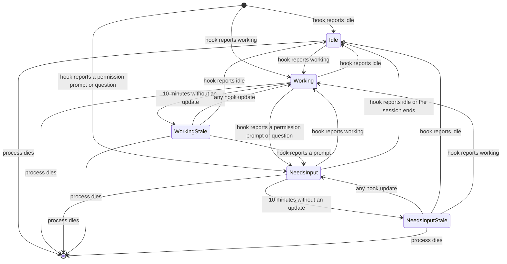

# Notifications

Programa provides a notification panel for AI agents like Claude Code, Codex, and OpenCode. Notifications appear in a dedicated panel and trigger macOS system notifications.

## Sidebar agent indicator

Each workspace row in the sidebar shows one agent indicator: a glyph plus a short label, "Needs input", "Working", or "Idle". The indicator is the only place the working/idle/blocked state appears, so nothing can fall out of sync. Verbose per-tool status text appears in its own row when the Claude Code verbose status setting is on.

"Needs input" appears only when a hook actually reports the agent is blocked on you (a permission prompt or a question), and it clears only when the agent resumes: a hook reports it's working or idle again, or the session ends. Opening or focusing the workspace does not clear it. It marks the notification read, but the agent still shows as needing input until the agent itself says otherwise. This is deliberate: closing the tab shouldn't silently answer a question that's still open.

If ten minutes pass with no hook update while an agent is marked "Working" or "Needs input", the indicator dims and its label grows a "(stale)" suffix ("Needs input (stale)", "Working (stale)"). Stale never clears itself; it's a signal that programa hasn't heard from the agent in a while, not a claim that the agent has actually stopped. A background watchdog also clears the indicator outright if the underlying agent process has died. Idle never goes stale, since it's already the resting state. Relaunching the app always starts with no agent indicators; the next hook event from a running agent restores it within one turn.

A workspace with several agent surfaces shows the worst state among them: needs input, then working, then idle. Agents without hooks (Gemini CLI, Copilot CLI, Cursor Agent, Aider) get their state from screen detection instead, and a hook report always wins over it.



The diagram's end state means no indicator is shown. Staleness is only a display state: it never changes the underlying state on its own.

## Quick Start

```bash
# Send a notification (if programa is available)
command -v programa &>/dev/null && programa notify --title "Done" --body "Task complete"

# With fallback to macOS notifications
command -v programa &>/dev/null && programa notify --title "Done" --body "Task complete" || osascript -e 'display notification "Task complete" with title "Done"'
```

## Detection

Check if `programa` CLI is available before using it:

```bash
# Shell
if command -v programa &>/dev/null; then
    programa notify --title "Hello"
fi

# One-liner with fallback
command -v programa &>/dev/null && programa notify --title "Hello" || osascript -e 'display notification "" with title "Hello"'
```

```python
# Python
import shutil
import subprocess

def notify(title: str, body: str = ""):
    if shutil.which("programa"):
        subprocess.run(["programa", "notify", "--title", title, "--body", body])
    else:
        # Fallback to macOS
        subprocess.run(["osascript", "-e", f'display notification "{body}" with title "{title}"'])
```

## CLI Usage

```bash
# Simple notification
programa notify --title "Build Complete"

# With subtitle and body
programa notify --title "Claude Code" --subtitle "Permission" --body "Approval needed"

# Notify a specific workspace and surface
programa notify --title "Done" --workspace workspace:1 --surface surface:2
```

## Agent integrations

Claude Code, Codex and OpenCode report their status and notifications through hooks that
Programa installs for you. Run the one for your agent from any terminal:

```bash
programa claude install-integration
programa codex install-integration
programa opencode install-integration
```

Each command prints the exact changes and asks before applying them; `--yes` (or `-y`)
skips the prompt. They write:

| Agent | Files |
|---|---|
| Claude Code | Hook entries in `~/.claude/settings.json` (or `$CLAUDE_CONFIG_DIR/settings.json`), and the `programa` skill in `~/.claude/skills/programa/SKILL.md`. |
| Codex | Hook entries in `~/.codex/hooks.json`, a `# BEGIN programa` ... `# END programa` block in `~/.codex/config.toml` that trusts those hooks, and the skill in `~/.agents/skills/programa/SKILL.md`. |
| OpenCode | The plugin `~/.config/opencode/plugins/programa.js` (or under `$OPENCODE_CONFIG_DIR`), and the skill in `~/.config/opencode/skills/programa/SKILL.md`. |

Remove an integration with `programa claude uninstall-integration`, `programa codex
uninstall-integration` or `programa opencode uninstall-integration`; each removes only what
its installer wrote. Everything outside the managed entries stays as you left it, so do not
add your own lines inside the Codex `# BEGIN programa` block.

The hooks fail open: when the agent runs outside Programa, or Programa is not reachable,
the hook answers the agent with its normal acknowledgement and the agent carries on.

## Other agents

### GitHub Copilot CLI

Copilot CLI supports [hooks](https://docs.github.com/en/copilot/how-tos/use-copilot-agents/coding-agent/use-hooks) that run shell commands at key lifecycle events. Add to `~/.copilot/config.json`:

```json
{
  "hooks": {
    "userPromptSubmitted": [
      {
        "type": "command",
        "bash": "if command -v programa &>/dev/null; then programa set-status copilot_cli Running; fi",
        "timeoutSec": 3
      }
    ],
    "agentStop": [
      {
        "type": "command",
        "bash": "if command -v programa &>/dev/null; then programa notify --title 'Copilot CLI' --body 'Done'; programa set-status copilot_cli Idle; else osascript -e 'display notification \"Done\" with title \"Copilot CLI\"'; fi",
        "timeoutSec": 5
      }
    ],
    "errorOccurred": [
      {
        "type": "command",
        "bash": "if command -v programa &>/dev/null; then programa notify --title 'Copilot CLI' --subtitle 'Error' --body \"$(cat | jq -r '.errorMessage // \"An error occurred\"' 2>/dev/null | head -c 100)\"; programa set-status copilot_cli Error; else osascript -e 'display notification \"An error occurred\" with title \"Copilot CLI\"'; fi",
        "timeoutSec": 5
      }
    ],
    "sessionEnd": [
      {
        "type": "command",
        "bash": "if command -v programa &>/dev/null; then programa clear-status copilot_cli; fi",
        "timeoutSec": 3
      }
    ]
  }
}
```

Or for repo-level hooks, create `.github/hooks/notify.json`:

```json
{
  "version": 1,
  "hooks": {
    "userPromptSubmitted": [ ... ],
    "agentStop": [ ... ]
  }
}
```

## Environment Variables

Programa sets these in child shells:

| Variable | Description |
|----------|-------------|
| `PROGRAMA_SOCKET_PATH` | Path to control socket |
| `PROGRAMA_WORKSPACE_ID` | UUID of the current workspace (also `PROGRAMA_TAB_ID`) |
| `PROGRAMA_SURFACE_ID` | UUID of the current surface (also `PROGRAMA_PANEL_ID`) |
| `PROGRAMA_DEFAULT_BROWSER` | Short key of the system default browser (e.g. `chrome`, `safari`, `arc`) -- see [socket-api.md](socket-api.md#browser-availability-appbrowsers-programa_default_browser) |
| `PROGRAMA_DEFAULT_BROWSER_BUNDLE_ID` | Bundle identifier of the system default browser |

See [environment-variables.md](environment-variables.md) for the full list.

## CLI Commands

```
programa notify --title <text> [--subtitle <text>] [--body <text>] [--workspace <id|ref>] [--surface <id|ref>]
programa list-notifications
programa clear-notifications
programa set-status <key> <value>
programa clear-status <key>
programa ping
```

## Best Practices

1. **Always check availability first** - Use `command -v programa` before calling
2. **Provide fallbacks** - Use `|| osascript` for macOS fallback
3. **Keep notifications concise** - Title should be brief, use body for details
