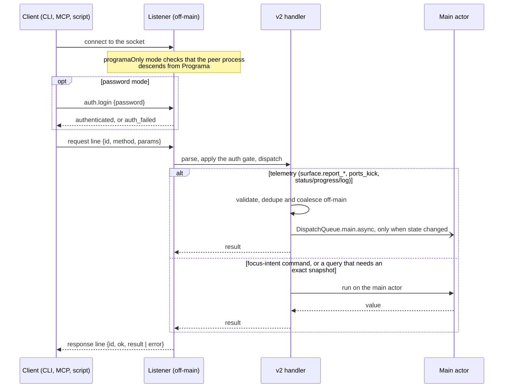

# Socket API

Programa exposes a local control socket. Its protocol is v2 JSON-RPC: one JSON object per line
over a Unix domain socket. The CLI, the MCP server, shell integration and your own scripts all
use it. A line that does not start with `{` gets a terse `v1_removed` error. The method table
below lists the former line-protocol command names next to their v2 methods, for reading old
scripts and bug reports.

The machine-readable contract is `contracts/v2/methods.json` (methods) and
`contracts/v2/protocol.json` (framing and auth handshake). See [Contract](#contract).

## Request path and threading

The listener runs off the main thread, so a slow or hostile client cannot stall the UI.
Handlers move work to the main actor only when they must.



Rules that follow from the diagram:

- High-frequency telemetry never blocks on the main thread. It is parsed and deduplicated
  off-main, and the UI mutation is scheduled with `DispatchQueue.main.async` only when
  something changed.
- Commands that drive AppKit or Ghostty state (focus, select, open, close, send input) and
  queries that need an exact snapshot run on the main actor.
- Only explicit focus-intent commands (`focus_intent: true` in the contract) change in-app
  focus or selection. Every other command leaves the user's focus alone.
- `contracts/v2/methods.json` records each method's `threading` (`main` or `off_main`).

## Security and discovery

### Socket modes

The mode is `automation.socketControlMode` in `settings.json` or **Settings > Automation**.
The default is `programaOnly`. The legacy name `cmuxOnly` is still accepted.

| Mode | Shown in Settings as | Who can connect |
|---|---|---|
| `off` | Off | Nobody. The socket is not created. |
| `programaOnly` | Programa processes only | Processes started inside Programa terminals. The server checks that the peer process descends from Programa. |
| `automation` | Automation mode | Any process of the same macOS user. No ancestry check. |
| `password` | Password mode | Any process of the same macOS user that authenticates with the socket password. |
| `allowAll` | Full open access | Any local process and user, with no auth. The socket file is world-writable (`0666`); every other mode uses `0600`. Unsafe. |

Older spellings are accepted and normalized: `openAccess` and `fullOpenAccess` mean `allowAll`,
`notifications` means `automation`, `full` means `allowAll`.

Two environment variables override the setting for one launch. `PROGRAMA_SOCKET_ENABLE`
(`1`/`true`/`yes`/`on` or `0`/`false`/`no`/`off`) turns the socket on or off, and
`PROGRAMA_SOCKET_MODE` sets the mode. Disabling wins over a mode.

A client denied by `programaOnly` receives a plain-text line, `ERROR: Access denied — only
processes started inside Programa can connect`, and the connection closes. It is not a JSON
error envelope.

### Where the socket lives

The app listens on:

| Build | Path |
|---|---|
| Release | `~/Library/Application Support/programa/programa.sock` (the per-user file `programa-<uid>.sock` in the same folder is used when `programa.sock` exists but belongs to another user or is not a socket) |
| Debug | `/tmp/programa-debug.sock` |
| Tagged Debug (`reload.sh --tag <tag>`) | `/tmp/programa-debug-<tag>.sock` |
| Staging | `/tmp/programa-staging.sock` |

`PROGRAMA_SOCKET_PATH` overrides the listener path only for Debug and Staging builds, or when
`PROGRAMA_ALLOW_SOCKET_OVERRIDE=1` is set. A tagged Debug build ignores it unless that variable
is set too.

Programa terminals export both `PROGRAMA_SOCKET_PATH` and `PROGRAMA_SOCKET` set to the socket of the
app that started them.
The app also writes the path it is listening on to
`~/Library/Application Support/programa/last-socket-path`.

### How clients find it

The CLI and `programa-mcp` share one resolver (`CLI/SocketPathResolution.swift`). The requested
path is, in order of precedence:

1. `--socket <path>` (CLI only). An explicit flag is used as given, with no discovery.
2. `PROGRAMA_SOCKET_PATH`.
3. `PROGRAMA_SOCKET`. The CLI, `programa-mcp` and the Python test helpers read this name; the app
   only exports it. `PROGRAMA_SOCKET_PATH` wins when both are set.
4. The default, `~/Library/Application Support/programa/programa.sock`.

A path from an environment variable is used as given, unless it is one of the default paths.
When the requested path is the default (or nothing was requested), the client picks the first
candidate that accepts a connection, then the first candidate that exists as a socket file:

1. `/tmp/programa-debug-<slug>.sock` and `/tmp/programa-<slug>.sock` when `PROGRAMA_TAG` is set
   (`<slug>` is the tag lowercased, with runs of other characters replaced by `-`)
2. the requested path
3. `~/Library/Application Support/programa/programa.sock`
4. `/tmp/programa.sock`

If none exists, the requested path is used and the connection error names it. The client never
connects on its own to a dev (`/tmp/programa-debug.sock`), staging or tagged socket, or the one
recorded in `last-socket-path`, because a command meant for your app would land in a different
build. When such sockets are live, the CLI lists them on stderr; pass `--socket <path>` or set
`PROGRAMA_SOCKET_PATH` and `PROGRAMA_SOCKET` to use one.

Inside a Programa terminal, both variables point at the socket of the app that hosts it, so a
script run there talks to that app. To drive a different instance, such as a tagged build, set both
`PROGRAMA_SOCKET_PATH` and `PROGRAMA_SOCKET` to its socket.

### Password flow

`password` mode needs a password. Programa looks for it in this order:

1. `PROGRAMA_SOCKET_PASSWORD` in the environment
2. the file `~/Library/Application Support/programa/socket-control-password` (mode `0600`,
   written by **Settings > Automation**; `automation.socketPassword` in `settings.json`)

The CLI takes `--password <value>` first, then `PROGRAMA_SOCKET_PASSWORD`, then the saved
password. `programa-mcp` reads only `PROGRAMA_SOCKET_PASSWORD`.

A client authenticates once per connection:

```json
{"id":"1","method":"auth.login","params":{"password":"..."}}
{"id":"1","ok":true,"result":{"authenticated":true,"required":true}}
```

Until it succeeds, every other method returns `auth_required`. A wrong password returns
`auth_failed` and a missing one returns `invalid_params`. After five failed `auth.login`
attempts the server closes the connection. Changing the password in Settings
invalidates existing authenticated connections. Outside password mode, `auth.login` succeeds
with `"required": false` and nothing else is needed.

Password mode keeps out processes that do not know the password. It is not a boundary against
other processes of the same macOS user: they can read the password file or the environment of
a process that has the password, so treat any same-user process as able to connect.

### Error codes

An error response is `{"id":..., "ok": false, "error": {"code": "...", "message": "..."}}`,
with an optional `data` field. Codes that any method can return:

| Code | Meaning |
|---|---|
| `v1_removed` | The line did not start with `{`. |
| `invalid_utf8` | The request was not valid UTF-8. |
| `parse_error` | The line was not valid JSON. |
| `invalid_request` | The JSON was not an object, `params` was not an object, or `method` was missing or empty. |
| `auth_required` | The socket is in password mode and this connection has not sent a successful `auth.login`. |
| `auth_failed` | `auth.login` had the wrong password. |
| `invalid_params` | A required parameter was missing or had the wrong type. |
| `not_found` | A referenced window, workspace, pane, surface or similar object does not exist, including a well-formed ref (`workspace:7`) or UUID that matches nothing. A malformed value is `invalid_params`. |
| `unavailable` | The app or a required subsystem cannot handle the request right now. Never used for a reference that does not resolve. |
| `internal_error` | An unexpected server-side failure. |
| `encode_error` | The server could not encode its own response. |

Individual methods add their own codes (for example `invalid_state`, `not_supported`, `timeout`,
`layout_not_found`, `worktree_dirty`). The full list per method is in `contracts/v2/methods.json`.
Two that scripts commonly meet:

- `limit_reached`: `surface.split` and `pane.create` on a workspace that already has four panes.
  The message is "Workspace already has the maximum of 4 panes" and `data` is
  `{"max_panes": 4}`. The check runs before anything is created.
- `invalid_state`: `workspace.close` on a window's last workspace. Close the window with
  `window.close` instead.

### Units

`pane.resize` takes `amount` in layout points along the resize axis. The handler defaults `amount` to 1
when it is omitted, although the contract marks it required. `programa resize-pane --amount <n>`
sends `n` as points. The tmux shim (`resize-pane -L|-R|-U|-D [n]`) takes `n` in terminal cells
(default 1) and `-x <columns>` / `-y <rows>` take absolute sizes; both convert to points with the
pane's `cell_width` / `cell_height` (cell size in layout points, from `pane.list`) before they call the method.

## Protocol sketch

Each request is one JSON object per line:

```json
{"id":"1","method":"workspace.list","params":{}}
```

Each response is one JSON object per line:

```json
{"id":"1","ok":true,"result":{...}}
```

Errors:

```json
{"id":"1","ok":false,"error":{"code":"not_found","message":"workspace not found"}}
```

Notes:
- `id` is echoed back when present (string or number).
- v2 methods accept **IDs**; v2 responses may include ephemeral `index` fields for ordering/debugging, but IDs are the stable handles.
- Auth (`auth.login`) is handled as a connection-level preamble before protocol dispatch, not a regular method — it worked the same way for v1 and v2 clients and was unaffected by the v1 removal.

## Method Parity Reference (former v1 name -> v2 method)

System:
- ping -> `system.ping` (liveness; the CLI's `ping` subcommand calls this and prints "PONG" on success)

Windows:
- list_windows -> `window.list`
- current_window -> `window.current`
- focus_window -> `window.focus`
- new_window -> `window.create`
- close_window -> `window.close`
- move_workspace_to_window -> `workspace.move_to_window`

Workspaces:
- list_workspaces -> `workspace.list`
- new_workspace -> `workspace.create`
- select_workspace -> `workspace.select`
- current_workspace -> `workspace.current`
- close_workspace -> `workspace.close`

Worktrees (new in v2, no v1 predecessor -- see "worktree.* / layout.*" below):
- (no v1 equivalent) -> `worktree.create`
- (no v1 equivalent) -> `worktree.open`
- (no v1 equivalent) -> `worktree.remove`
- (no v1 equivalent) -> `worktree.list`

Layouts (new in v2, no v1 predecessor -- see "worktree.* / layout.*" below):
- (no v1 equivalent) -> `layout.save`
- (no v1 equivalent) -> `layout.apply`
- (no v1 equivalent) -> `layout.list`

Session snapshot history (new in v2, no v1 predecessor -- see `docs/plans/snapshot-restore.md`):
- (no v1 equivalent) -> `snapshot.list`
- (no v1 equivalent) -> `snapshot.restore`

Agent detection (new in v2, no v1 predecessor -- see "agent.detection.*" below):
- (no v1 equivalent) -> `agent.detection.list`
- (no v1 equivalent) -> `agent.detection.classify`

Surfaces / Splits:
- list_surfaces -> `surface.list`
- focus_surface / focus_surface_by_panel -> `surface.focus`
- new_split -> `surface.split`
- new_surface -> `surface.create`
- close_surface -> `surface.close`
- drag_surface_to_split -> `surface.drag_to_split`
- refresh_surfaces -> `surface.refresh`
- surface_health -> `surface.health`
- trigger_flash -> `surface.trigger_flash` (new in v2)
- (no v1 equivalent) -> `surface.wait` (new in v2, see "surface.wait" below)
- (no v1 equivalent) -> `agent.prompt` (new in v2, see "agent.prompt" below)
- (no v1 equivalent) -> `subscribe`/`unsubscribe` (new in v2, see "Socket Event Subscriptions" below)
- (no v1 equivalent) -> `review.open` / `review.refresh` / `review.comment.add` / `review.comment.remove` / `review.comment.list` / `review.send_comments` (new in v2, see "Review Panel" below)

Surface Telemetry (report_*/ports/git/pr — off-main parse, main.async mutate; see "Socket
command threading policy" in the root `CLAUDE.md`):
- report_tty -> `surface.report_tty`
- ports_kick -> `surface.ports_kick`
- report_pwd -> `surface.report_pwd`
- report_shell_state -> `surface.report_shell_state` (shares the `SocketFastPathState` dedup helper)
- report_git_branch -> `surface.report_git_branch`
- clear_git_branch -> `surface.clear_git_branch`
- report_pr / report_review -> `surface.report_pr`
- clear_pr -> `surface.clear_pr`
- report_ports -> `surface.report_ports`
- clear_ports -> `surface.clear_ports` (omit `surface_id` to clear all ports for the workspace)

Panes:
- list_panes -> `pane.list`
- focus_pane -> `pane.focus`
- list_pane_surfaces -> `pane.surfaces`
- new_pane -> `pane.create`

Input:
- send / send_surface -> `surface.send_text`
- send_key / send_key_surface -> `surface.send_key`

Sidebar Metadata (workspace-scoped — the set_status/log/set_progress/sidebar_state family
mutates a `Tab`/`Workspace`, not a specific surface; mutations are off-main + main.async,
reads use `v2MainSync` like sibling read methods):
- set_status -> `workspace.set_status`
- clear_status -> `workspace.clear_status`
- list_status -> `workspace.list_status`
- log -> `workspace.log`
- clear_log -> `workspace.clear_log`
- list_log -> `workspace.list_log`
- set_progress -> `workspace.set_progress`
- clear_progress -> `workspace.clear_progress`
- sidebar_state -> `workspace.sidebar_state`
- clear_agent_pid -> `workspace.clear_agent_pid`
- set_agent_pid -> `workspace.set_agent_pid`
- report_meta / clear_meta / list_meta -> alias of `workspace.set_status` / `clear_status` / `list_status`
- report_meta_block -> `workspace.report_meta_block`
- clear_meta_block -> `workspace.clear_meta_block`
- list_meta_blocks -> `workspace.list_meta_blocks`
- reset_sidebar -> `workspace.reset_sidebar`
- read_screen -> `surface.read_text` (already covered read_screen's scrollback/lines semantics)

Notifications:
- notify -> `notification.create`
- notify_surface -> `notification.create_for_surface`
- notify_target -> `notification.create_for_target`
- list_notifications -> `notification.list`
- clear_notifications -> `notification.clear` (accepts an optional `workspace_id` to scope the clear to one workspace, matching v1's `--tab=X`; omitting it clears all notifications, matching v1's bare `clear_notifications`)
- set_app_focus -> `app.focus_override.set`
- simulate_app_active -> `app.simulate_active`
- reload_config -> `app.reload_config`
- (no v1 equivalent) -> `app.browsers` (new in v2: lists known browsers with install/running status and the system default; see "Browser Availability" below)

Debug / Test-only:
- set_shortcut -> `debug.shortcut.set`
- simulate_shortcut -> `debug.shortcut.simulate`
- simulate_type -> `debug.type`
- activate_app -> `debug.app.activate`
- is_terminal_focused -> `debug.terminal.is_focused`
- read_terminal_text -> `debug.terminal.read_text`
- render_stats -> `debug.terminal.render_stats`
- layout_debug -> `debug.layout`
- bonsplit_underflow_count/reset -> `debug.bonsplit_underflow.*`
- empty_panel_count/reset -> `debug.empty_panel.*`
- focus_notification -> `debug.notification.focus`
- flash_count/reset -> `debug.flash.*`
- panel_snapshot/panel_snapshot_reset -> `debug.panel_snapshot.*`
- screenshot -> `debug.window.screenshot`

## `surface.wait` (#166)

Server-owned, event-driven wait on a single surface: block the connection (with a timeout)
until a condition is met, instead of the caller polling `surface.read_text` in a loop. One
request, one response — no subscription/unsubscribe pair to manage. CLI: `programa
wait-surface`.

Request params (exactly one of `pattern` / `exit` / `agent_state` / `program_state` is required):

| Field | Type | Required | Notes |
|---|---|---|---|
| `workspace_id` / `surface_id` | string (id or ref) | no | Same resolution as other `surface.*` methods; defaults to the current workspace's focused surface. |
| `pattern` | string | one of `pattern`/`exit`/`agent_state` | Regex (ICU/`NSRegularExpression` syntax) matched against the surface's current text (screen + scrollback) on every check. |
| `exit` | bool | one of `pattern`/`exit`/`agent_state` | Wait for the surface's child process to exit. |
| `agent_state` | string | one of `pattern`/`exit`/`agent_state` | Wait for the surface's #164 agent activity state to reach `idle`, `working`, `blocked`, or transition at all (`any_change`). |
| `program_state` | string | one of the conditions | Wait for the surface's OSC 7501 root record to reach `idle`, `working`, `done`, `blocked`, `error`, `cleared` (no root record), or transition at all (`any_change`). See `docs/program-status.md`. |
| `timeout_ms` | int | no | Default `30000`, at most `3600000` (one hour). Also accepts `timeout` (same units) for convenience. |
| `lines` | int | no | Caps how many trailing lines of scrollback `pattern` rereads per check (default `2000`); does not apply to `exit`/`agent_state`. |

Response (`ok: true`):

```json
{
  "id": "1",
  "ok": true,
  "result": {
    "workspace_id": "...", "workspace_ref": "workspace:1",
    "surface_id": "...", "surface_ref": "surface:2",
    "window_id": "...", "window_ref": "window:1",
    "condition": "pattern",
    "waited": true,
    "match": "BUILD SUCCEEDED"
  }
}
```

- `waited: false` means the condition was already true the instant the call arrived (a marker
  already present in scrollback, the surface had already exited, or its agent_state already
  satisfied the requested condition) — the caller never actually blocked.
- `match` is only present for `pattern` waits and is the substring the regex matched.
- `state` is only present for `agent_state` waits and is the observed value (`"idle"`,
  `"working"`, `"blocked"`, or `null` for "no state reported") at resolution.
- `source` is only present for `agent_state` waits and is the additive sibling
  (docs/plans/screen-manifest-detection.md) telling you *who* reported `state`: `"hooks"` (a
  lifecycle hook — Claude Code/Codex/OpenCode) or `"inferred"` (the screen-manifest detection
  engine pattern-matching the terminal buffer for agents with no installed hooks). `null` iff
  `state` is `null`. Hooks always win: a surface's source only ever reads `"inferred"` if no
  hook has ever reported for it. `"program"` means the program in the terminal reported its own
  status with OSC 7501 (`docs/program-status.md`); `surface.report_agent_state` rejects
  `source: "program"` with `invalid_params`. Manifest schema/authoring guidance for the `"inferred"` tier:
  `docs/agent-detection-manifests.md`.
- `program_state` is only present for `program_state` waits and is the root record's state at resolution (`null` when the surface has no root record). A surface with no root record satisfies only `cleared`, never `idle`.
- Timeout: `{"ok": false, "error": {"code": "timeout", "message": "...", "data": {"timeout_ms": N}}}`.
- If the target surface does not exist when the call arrives, the response is `not_found`.
- If the surface closes while the wait is in flight, the wait resolves at once with
  `ok: true` and `"outcome": "closed"`, so callers never wait out the full timeout to learn the
  surface is gone.

### `agent_state` condition values and the no-state rule

- `idle` — the surface's agent_state is `idle`, **or has never been reported at all**. Most
  terminals never report anything (no agent hooks installed), and a caller waiting for "idle"
  almost always means "not currently busy" — which is true of a bare terminal too. This is the
  one asymmetry versus `working`/`blocked`, which both require an actual explicit report; there
  is nothing to observe in the no-state case for those.
- `working` — the surface's agent_state is `working`.
- `blocked` — the surface's agent_state is `blocked` (a hook reported a permission/approval/
  question prompt — see #164).
- `any_change` — resolves on the *next* agent_state transition after the call arrives (including
  a transition to "no state" on clear/reset). Never counts as already-satisfied at registration
  time, even if the state happens to already differ from some caller-assumed baseline — there is
  nothing to compare against until a transition is actually observed.

Backpressure / disconnect: `surface.wait` holds its socket connection's dedicated thread for up
to `timeout_ms` (each connection is handled on its own thread — see `TerminalController.
handleClient` — so this never blocks other connections or the main thread). If the client
disconnects mid-wait, the in-flight `write()` of the eventual response simply fails and is
ignored; for the `exit`/`agent_state` conditions the registered watcher (in
`SurfaceExitWaitRegistry` / `AgentStateWaitRegistry`) still fires and is still cleaned up (the
callback is a fire-and-forget semaphore signal with nothing left to notify). There is no
server-side cap on concurrent waits; each is an independent blocked thread.

No-missed-events guarantee: the "is the condition already true?" check and "install the watcher"
step happen inside the same synchronous main-thread hop (`v2MainSync`), so a pattern marker
printed the instant the call arrives, a child-exit racing the call, or an agent_state change
racing the call, is always observed — see the doc comments on `SurfaceExitWaitRegistry`,
`AgentStateWaitRegistry`, and `TerminalController.v2SurfaceWait` in
`Sources/TerminalController+SurfaceWait.swift`. The `pattern` condition itself is polled
internally (Ghostty doesn't expose a push-based "surface content changed" callback the way it
does for child-exit) at a fixed ~100ms interval on the connection's own thread; `exit` and
`agent_state` are fully event-driven with no polling — `exit` off the same
`GHOSTTY_ACTION_SHOW_CHILD_EXITED` action that already closes the panel on process exit,
`agent_state` off the single main-thread mutation point for `Workspace.panelAgentStates`
(`Workspace.updatePanelAgentState`/`clearPanelAgentState`, always called from
`TerminalController+Telemetry.swift`'s `v2SurfaceReportAgentState`/`v2SurfaceClearAgentState` via
`DispatchQueue.main.async`).

### `program_status` on `surface.list` and `system.tree`

Every terminal surface entry carries `program_status`: the surface's OSC 7501 root record, or
`null` when it has none. `agent_state` keeps its three values; `program_status.state` is how a
client tells `done` and `error` from `idle`.

```json
"program_status": {"state": "done", "kind": null, "progress": null, "app": "claude-code", "has_message": true, "updated_at": 1759800000.0}
```

Record text is never on the wire. The object has no `msg`, no `title` and no child ids, because
any process in a Programa terminal can read the socket and the protocol forbids revealing record
contents back to programs. `has_message` says whether a message exists. `app` is the identifier
the program chose, limited to 1-32 characters of `A-Za-z0-9_.+-`.

## `surface.resolve_tty`

Finds the terminal surface attached to a tty, for CLI hooks that bind their caller by tty.

| Field | Type | Required | Notes |
|---|---|---|---|
| `tty` | string | yes | A `/dev/ttysNNN` path or the bare name (`ttys004`). |

Returns `{"workspace_id", "workspace_ref", "surface_id", "surface_ref"}` for the one matching
terminal surface. Errors: `invalid_params` when `tty` is missing or empty, `not_found` when no
terminal surface has that tty. The lookup changes no focus or selection.

## Text delivery: `queued`

`surface.send_text` and `agent.prompt` include `"queued": true` in the result when the target
terminal was not attached yet and the text went to its pending queue; it is delivered once the
terminal attaches. The field is absent or `false` when the text was written directly.

## `agent.prompt` (#166)

Submit a prompt to an agent surface and wait for it to finish, in one request — built on
`surface.send_text`'s injection path plus `surface.wait`'s `agent_state` condition. CLI: `programa
prompt-agent`.

Request params:

| Field | Type | Required | Notes |
|---|---|---|---|
| `workspace_id` / `surface_id` | string (id or ref) | no | Same resolution as other `surface.*` methods; defaults to the current workspace's focused surface. |
| `text` | string | yes | The prompt. Enter is always submitted after it (trailing whitespace/newlines in `text` are trimmed first, so this never sends a stray blank line) — callers don't pass their own line ending. |
| `timeout_ms` | int | no | Overall budget for the agent to finish. Default `120000`. Also accepts `timeout`. |
| `working_grace_ms` | int | no | How long to wait for the agent to report it started working before giving up on observing that transition, capped by the remaining overall `timeout_ms` budget. Default `3000`. |

Response (`ok: true`):

```json
{
  "id": "1",
  "ok": true,
  "result": {
    "workspace_id": "...", "workspace_ref": "workspace:1",
    "surface_id": "...", "surface_ref": "surface:2",
    "window_id": "...", "window_ref": "window:1",
    "working_observed": true,
    "final_state": "idle"
  }
}
```

`warning` is present (success, not an error) when the surface never reported any `agent_state` at
all — neither before the prompt was sent nor during the grace window — which usually means agent
hooks were never installed for this surface.

### Semantics (phased, event-driven — no polling)

1. **Send + register, atomically.** The text is sent via the exact same path
   `surface.send_text` uses, and — inside that *same* main-thread hop — the surface's
   `agent_state` at that instant is captured and a watcher for the next `working` transition is
   registered via `AgentStateWaitRegistry`. This closes the race where a hook reacts to the
   injected text before a separately-registered watcher would exist (the same atomic
   check+register pattern `surface.wait` uses).
2. **Grace window (`working_grace_ms`).** Wait for the `working` transition, capped by the
   remaining overall `timeout_ms` budget.
   - Observed → go to step 3.
   - Not observed by the time the grace window or overall deadline elapses → there is nothing
     further useful to wait for, so resolve immediately using whatever `agent_state` the surface
     already has (`working_observed: false`). This is deliberately not a timeout error: a prompt
     can finish faster than the grace window, or a hook simply may not fire for a trivial prompt.
3. **Wait for idle.** Having observed `working`, wait — for the *remaining* overall
   `timeout_ms` budget — for `agent_state` to reach `idle` (the same no-state-is-idle rule as
   `surface.wait` applies: a hook that clears its own state on session end also counts).
   Resolves with `working_observed: true`.
4. **Timeout.** If step 3's wait exceeds the remaining budget, the call fails with
   `{"code": "timeout", ...}` — the agent started working but never finished in time.

If the surface was already `working` when the prompt was sent (e.g. a second prompt queued while
one is running), step 2 is skipped entirely and the call goes straight to step 3.

## Review Panel (`review.*`, docs/plans/diff-review-panel.md)

Agent diff review panel: a panel beside a terminal surface showing its worktree diff
(uncommitted changes, or vs a branch merge-base), with line comments that get sent back into
the terminal's input as `path:start-end — text`. CLI: `programa review open|refresh|comment|send`.

### `review.open`

Opens a review panel split beside a terminal surface. Mirrors `markdown.open`'s param/response
shape, plus a `focus` param (default `false` — this command never activates the app or moves
focus unless the caller explicitly opts in).

| Field | Type | Required | Notes |
|---|---|---|---|
| `surface_id` | string (id or ref) | no | Source terminal surface to review + split from. Defaults to the focused surface. Its `panelDirectories` entry supplies the git working directory. |
| `workspace_id` / `window_id` | string | no | Same resolution as other `surface.*`/`markdown.*` methods. |
| `mode` | string | no | `"uncommitted"` (default) — diff vs `HEAD`, includes uncommitted changes. `"branch"` — diff vs merge-base with `base_branch` (falls back to local `main`, then `master`, if the requested base doesn't resolve). |
| `base_branch` | string | no | Only used when `mode: "branch"`. Default `"origin/main"`. |
| `direction` | string | no | Split direction, default `"right"`. |
| `focus` | bool | no | Default `false`. Only when `true` does this command activate the app/window and move pane focus to the new panel. |

Response (`ok: true`): `window_id/_ref, workspace_id/_ref, pane_id/_ref, surface_id/_ref` (the new
review panel), plus `source_surface_id/_ref` (the terminal being reviewed), `mode`,
`base_branch`, `file_count`, and `diffable_file_count`.

Errors: `not_found` (no focused surface / source surface not found), `invalid_params` (bad
`mode`/`direction`), `unavailable` (resolved directory isn't inside a git worktree).

### `review.refresh`

Re-runs the diff for an existing review panel. `surface_id` (the review panel's own id) or
workspace-focused-review-panel fallback. Response: `{"file_count": N, "diffable_file_count": M,
"generated_at": <unix ts>}`. Never activates the app or moves focus.

### `review.comment.add` / `review.comment.remove` / `review.comment.list`

Pure in-memory comment metadata on a review panel, addressed by `surface_id` (the review panel).
`add` takes `file_path` (repo-relative), `start_line`/`end_line` (1-based, new-file line
numbers), `text` -> `{"comment_id": "..."}`. `remove` takes `comment_id` -> `{"ok": true}`.
`list` -> `{"comments": [{"id", "file_path", "start_line", "end_line", "text", "created_at",
"is_stale"}]}` — `is_stale` is `true` when a refresh could no longer find that file/line range
(the comment is never dropped, only flagged).

### `review.send_comments`

Serializes every pending comment (`path:start-end — text`, one per line, file-then-line order)
and sends it into the *source* terminal surface via the same path `surface.send_text` uses (with
Enter submitted after, like `agent.prompt`), then clears the sent comments.

| Field | Type | Required |
|---|---|---|
| `surface_id` | review panel id/ref | yes (or workspace-focused fallback) |
| `preamble` | string | no — override the default "Code review comments" preamble |

Response (`ok: true`): `{"sent_count": N, "target_surface_id"/"_ref": "..."}`. Sending zero
pending comments is a no-op (`sent_count: 0`), not an error.

## Socket Event Subscriptions (#167)

`subscribe` upgrades the calling connection to receive pushed events — agent state changes
(#164), coalesced surface output, and workspace lifecycle changes — instead of the caller
polling `surface.list`/`workspace.list`. Written before implementation, per the issue's ask that
backpressure/disconnect semantics be specified up front.

**This is not the front door.** `surface.wait` (one-shot conditions) and `agent.prompt` (submit +
wait) cover the common "wait for one thing" case in a single request/response round trip with no
queue/backpressure/reconnect model to manage. `subscribe` is for consumers that need *many*
events over time — dashboards, orchestrators, the menu bar of another machine — so a casual
caller never has to touch subscription machinery. CLI: `programa watch-events` (also positioned
as the advanced path, not the default way to wait for something).

### `subscribe`

| Field | Type | Required | Notes |
|---|---|---|---|
| `classes` | array of string | yes | Any of `agent_state`, `output`, `workspace_lifecycle`. Non-empty. |
| `surface_ids` | array of string (id or ref) | required iff `classes` includes `output` | `output` is opt-in per surface — broadcasting every surface's output to every subscriber by default would be prohibitively expensive. |

Response (`ok: true`): `{"subscription_id": "...", "classes": [...], "surface_ids": [...],
"max_queued_events": 256}`. A second `subscribe` on the same connection replaces the first
subscription (a connection has at most one).

### `unsubscribe`

No params. Tears down any live subscription on the calling connection; `ok: true` even if there
wasn't one, so a client doesn't need to track whether it subscribed.

### Event frames

Pushed events are **not** wrapped in the usual `{"id", "ok", "result"}` v2 envelope (there is no
request they're a response to) — each is its own single-line JSON object with an `"event"` key:

```json
{"event": "agent_state", "workspace_id": "...", "surface_id": "...", "state": "working", "source": "hooks", "ts": 1737590400.123}
{"event": "output", "workspace_id": "...", "surface_id": "...", "text": "new terminal output...", "ts": 1737590400.223}
{"event": "workspace_lifecycle", "kind": "renamed", "workspace_id": "...", "title": "new title", "ts": 1737590400.323}
{"event": "dropped", "count": 7}
```

- `agent_state.state` is `null` for a transition to "no state" (clear/reset) — same value shape
  as `surface.wait`'s `agent_state` result.
- `agent_state.source` is the same additive `"hooks" | "inferred" | null` sibling documented
  under `surface.wait`'s `agent_state` condition above (screen-manifest detection,
  docs/plans/screen-manifest-detection.md) — `null` iff `state` is `null`.
- `agent_state.program_status` is present only when `source` is `"program"`, with the same object `surface.list` returns. Frames fire when the presence changes, so a `done` to `error` change is delivered although both read `agent_state: "idle"`.
- `output.text` is the *newly appended* tail since the last tick for that surface, capped at
  4000 characters — never the full buffer, and never per-byte (see Backpressure below).
- `workspace_lifecycle.kind` is `created`, `closed`, or `renamed`. `renamed` fires only from the
  explicit rename entry point (tab-bar rename, `workspace.rename`) — not from automatic
  shell-title updates, which would otherwise flood subscribers on every `cd`.

### Backpressure

Each subscription owns a bounded, **drop-oldest** queue of **256 events**, drained on its own
dedicated serial dispatch queue — never on the thread that mutated app state (agent-state
mutation, output polling), so a slow or blocked client socket write never stalls a telemetry
mutation or the main thread. When the queue is full and a new event arrives, the oldest queued
event is evicted to make room (a client that's falling behind gets the *freshest* events, not a
growing backlog). Every time this happens, a `{"event": "dropped", "count": N}` frame is spliced
in ahead of the next real frame, so a client that sees one knows it may have missed events and
should re-sync current state with `surface.list`/`workspace.list` (frames carry `surface_id`/
`workspace_id` specifically so that re-sync is cheap and targeted).

`output` events are coalesced on a shared ~100ms poll tick across all watched surfaces (see
`TerminalController.v2StartOutputPollLoopIfNeeded`) — reusing the same point-in-time text read
`surface.wait`'s `pattern` condition uses, since Ghostty doesn't expose a push-based
"content changed" callback at the app layer. One thread total drives this regardless of
subscriber/surface count, and it is a no-op tick whenever nothing is being watched.

### Disconnect

The first failed `write()` (client gone) tears the subscription down immediately and unregisters
it from the broadcaster — no further events are enqueued for it. A connection's read loop
(`TerminalController.handleClient`) also unconditionally tears down any attached subscription
before closing the socket, covering client-initiated close and app shutdown alike. There is no
server-side cap on concurrent subscriptions.

## `worktree.*` / `layout.*` (docs/plans/worktree-and-layouts.md)

Native git worktree workflow + named layout configs. Both new in v2 (no v1 predecessor). All
seven methods parse/validate params off-main; the actual git/filesystem I/O runs inside
`GitWorktreeManager`/`ProgramaLayoutStore` (blocking by construction, same pattern as
`GitMetadataProber`); `v2MainSync` is used only around the final `tabManager.addWorkspace` /
`closeWorkspace` mutation, matching `workspace.create`'s existing shape. None of the seven steal
focus by default — `worktree.create` and `worktree.open` accept an opt-in `focus: bool` (default
`false`), gated through the existing `v2FocusAllowed()`/`focusIntentV2Methods` mechanism.

### `worktree.create`

| Field | Type | Required | Notes |
|---|---|---|---|
| `repo` | string | yes | Any directory inside the repo; resolved via `git rev-parse --show-toplevel`. |
| `branch` | string | yes | Checked out if it already exists locally; otherwise created from `base`. |
| `base` | string | no | Ref to branch a new `branch` from. Default `HEAD`. Ignored if `branch` already exists. |
| `path` | string | no | Default `<worktrees.directory>/<repo-name>/<branch-slug>` (`worktrees.directory` setting, default `~/.programa/worktrees`). |
| `layout` | string | no | Name of a saved layout (`layout.save`) to apply into the new workspace, baseCwd = the worktree root. |
| `focus` | bool | no | Default `false`. |

Result: `{"worktree": {"path", "branch", "repo"}, "workspace_id", "workspace_ref", "window_id", "window_ref"}`.

Errors: `not_a_git_repo`, `branch_checked_out` (pre-detected via `git worktree list --porcelain`,
not git's error text), `worktree_path_exists`, `layout_not_found`, `git_command_failed`.

### `worktree.open`

| Field | Type | Required | Notes |
|---|---|---|---|
| `repo` | string | yes | Same resolution as `worktree.create`. |
| `path` | string | one of path/branch | Absolute or relative worktree path. |
| `branch` | string | one of path/branch | Matched against `git worktree list`. |
| `focus` | bool | no | Default `false`. |

Idempotent: if the worktree is already open as a workspace, returns that `workspace_id` instead
of creating a duplicate. Result shape matches `worktree.create`. Errors: `invalid_params`,
`worktree_not_found`.

### `worktree.remove`

| Field | Type | Required | Notes |
|---|---|---|---|
| `repo` | string | yes | |
| `path` / `branch` | string | one required | |
| `force` | bool | no | Only overrides git's dirty-worktree refusal; never passed for any other reason. Never deletes the branch. |

Result: `{"removed": true, "closed_workspace_id"?}`. Closes the associated workspace if it was
open. Errors: `invalid_params`, `worktree_not_found`, `worktree_dirty`, `git_command_failed`.

### `worktree.list`

`{repo?}` -> `{"repo", "worktrees": [{"path", "branch", "head", "is_open", "workspace_id"?, "workspace_ref"?}]}`.
Errors: `not_a_git_repo`.

### `layout.save`

`{name, force?}` -> `{"name", "path"}`. Captures the current workspace via
`Workspace.captureCustomLayout()` (pane/split tree, cwds — not
command/env/focus, which have no live "what's running" signal). Errors: `already_exists`
(unless `force`), `invalid_name`, `no_active_workspace`.

### `layout.apply`

`{name, workspace_id?, cwd?}` -> `{"workspace_id", "workspace_ref", "window_id"?, "window_ref"?}`.
If `workspace_id` is omitted, creates a new (never-focused) workspace first with `cwd` (or its
own default cwd), then applies the layout into it — the same `Workspace.applyCustomLayout`
engine `programa.json` layouts already use, so relative `cwd`s in the saved layout resolve
against the new workspace's root. Errors: `not_found`.

### `layout.list`

`{}` -> `{"layouts": [{"name", "saved_at"}]}`.

## `agent.detection.*` (docs/plans/screen-manifest-detection.md)

Backs the `programa agent-detection` CLI command (`list`/`scaffold`/`test`), which lets users
author their own screen-manifest for an agent programa doesn't ship a bundled manifest for.
`AgentManifestLoader` loads bundled manifests (`Resources/AgentDetection/*.json`) plus any user
override at `~/.config/programa/agent-detection/<agent-id>.json`; an override fully replaces the
bundled manifest for that agent id -- no field merge. `scaffold` itself has no dedicated method
-- it reuses `surface.read_text` for the screen capture and writes the starter file client-side,
but calls `agent.detection.list` first when scaffolding one of the seven bundled agent ids (see
below), to seed the new file from the bundled manifest's own patterns.

### `agent.detection.list`

`{}` -> `{"manifests": [{"agent", "display_name", "source", "process_names", "shadows_bundled", "states"}]}`.
`source` is `"bundled"` or `"override"`. `shadows_bundled` is `true` when an override exists for
one of the seven ids in `AgentManifestLoader.bundledAgentIds` -- i.e. this entry silently
replaced a working bundled manifest. `states` is the full state-rule list (`bucket`, `priority`,
`anchor_last_n_lines`, `patterns`, `confidence`, `source_notes`), included so `agent-detection
scaffold --force` can seed a forced override from what's currently loaded instead of writing a
blank manifest over a working one.

The result also carries `rejected`: manifest files that were not loaded because a pattern does
not compile, as `[{"agent", "path", "reason"}]`. It is empty when every manifest loaded, and
tells an author why their override is not active.

### `agent.detection.classify`

| Field | Type | Required | Notes |
|---|---|---|---|
| `workspace_id` / `surface_id` | string | no | Same resolution as `surface.read_text`; defaults to the focused surface. |
| `agent` | string | no | Test one manifest's state patterns directly, bypassing recognition -- the authoring shortcut right after `scaffold`, before `recognize.screen_patterns` is filled in. Omit to run the real recognition path (checks every loaded manifest's `recognize.screen_patterns` against the current screen, first match wins) the same way live detection would. |

Result: `{"requested_agent", "recognized_via" ("explicit"|"screen_pattern"|null), "agent", "display_name", "bucket", "confidence", "matched_pattern", "workspace_id"?, "surface_id"?}` (all
null when nothing was recognized/classified). Errors: `not_found` (unknown `agent`), plus
whatever `surface.read_text` can return for the target surface.

## `agent.spawn`

Starts an agent in a new workspace. A nested-workspace spawn returns `agent_id`,
`workspace_id`, `workspace_ref`, `pane_id`, `pane_ref`, `surface_id`, `surface_ref`, `focused`
and `agent`; `pane_id` and `pane_ref` identify the pane hosting the spawned terminal, so
callers can target it without a separate lookup. The new workspace is created without taking
focus.

## `agent.event` (docs/plans/agent-events.md)

A normalized alternative to `surface.report_agent_state` for providers whose hooks carry more
structure than a bare `working|blocked|idle` string. Both methods write through the exact same
`updatePanelAgentState(source: .hooks)` path (`Sources/Workspace+SidebarTelemetry.swift`), so
hooks-always-win precedence and the `agent_state`/`agent_state_source` shape on `surface.list`,
`surface.wait`, and `subscribe` are unchanged — `agent.event` is a richer *input* to the same
tri-state model, not a new wire value.

| Field | Type | Required | Notes |
|---|---|---|---|
| `workspace_id` / `surface_id` | uuid | yes | Same resolution as other `surface.*` telemetry calls. |
| `event_type` | string | yes | One of: `session.started`, `session.exited`, `turn.started`, `turn.completed`, `turn.aborted`, `request.opened`, `request.resolved`, `user-input.requested`, `user-input.resolved`, `item.started`, `item.completed`. Case/whitespace-insensitive. Unrecognized values return `invalid_params`. |
| `provider` / `session_id` / `turn_id` / `item_id` / `label` / `resolution` | string | no | Passed through for future richer consumers (e.g. a turn-progress UI); not used for state classification in this pass. |

`event_type` maps to a tri-state write via `AgentEventNormalizer.classify` — see
docs/plans/agent-events.md's mapping table for the full list, and its "Provider coverage" table
for which providers' hooks (Claude Code, Codex, OpenCode) currently emit which event types.
`session.exited` clears the surface's agent state (same effect as `surface.clear_agent_state`);
every other recognized `event_type` applies a state and echoes `state`/`source: "hooks"`
alongside the same `workspace_id`/`workspace_ref`/`surface_id`/`surface_ref`/`event_type` fields
every other telemetry report echoes. Errors: `invalid_params` (missing/invalid
`workspace_id`/`surface_id`/`event_type`).

CLI: `programa agent-event --event <event_type> [--provider <p>] [--session-id <id>] [--turn-id <id>] [--item-id <id>] [--label <text>] [--resolution <r>] [--workspace <id|ref>] [--surface <id|ref>]`.

`surface.report_agent_state` and `agent.event` both also accept optional `provider`, `session_id`,
and `pid` params now. They key the report to a hook session and register the pid for the stale-PID
watchdog and port scanning; older CLI builds that omit them still work, they just leave the report
unkeyed.

## `agent.needs_input` (docs/plans/agent-state-unification.md)

Atomically reports a surface as blocked on user input and posts the matching notification, in one
socket round trip instead of the three separate calls (`notification.create_for_target`,
`workspace.set_status`, `surface.report_agent_state`) a blocking-prompt hook used to make. Any one
of those three could fail independently; `agent.needs_input` can't leave the sidebar badge, the
notification panel, and agent supervision disagreeing with each other, because it's a single write.

| Field | Type | Required | Notes |
|---|---|---|---|
| `workspace_id` / `surface_id` | uuid | yes | Same resolution as other `surface.*` telemetry calls. |
| `provider` / `title` / `subtitle` / `body` | string | no | Notification content; same fields `notification.create_for_target` took. |
| `session_id` / `pid` | string / integer | no | Same as `agent.event`'s and `surface.report_agent_state`'s new optional fields — keys the report to a hook session and registers the pid for the watchdog. |
| `kind` | string | no | `"permission"` or `"question"`, for a future richer UI; not required for the tri-state write itself. |

Writes presence `state: "blocked"`, `source: "hooks"` through the same
`updatePanelAgentState` funnel every other agent-state write uses, then posts the notification and
updates `AgentSupervisionRegistry` in the same handler call. Existing methods
(`surface.report_agent_state`, `agent.event`, `notification.create_for_target`,
`workspace.set_status`) all keep working unchanged; `agent.needs_input` is additive, and installed
hook configuration on user machines doesn't need reinstalling to pick it up. Errors:
`invalid_params`, `not_found`.

## Workspace `agent_state` and `helper_outcomes`

`workspace.list` and `system.tree` entries carry an aggregate `agent_state` of `idle`,
`working` or `blocked`. It combines hook-reported and inferred surface states with helpers that
have not finished yet; a finished helper does not hold it at failed or completed. Finished
helpers are counted in `helper_outcomes`, for example
`{"failed": 1, "completed": 2, "cancelled": 0}`.

## `ports.list` / `ports.stop`

The ports hub in the sidebar footer and the `programa list-ports` / `programa stop-port` commands run on these two methods. Both run on the main actor, because they read the hub store and workspace list as one snapshot, and neither activates the app or changes focus.

### `ports.list`

Params: none. Returns the TCP ports that processes started from Programa terminals (and tracked agents) are listening on, plus processes left running after their panel closed.

```json
{
  "workspaces": [
    {"id": "<uuid>", "ref": "workspace:1", "title": "api",
     "ports": [{"port": 3000, "pid": 4242, "command": "node",
                "surface_id": "<uuid or null for agent-owned>", "surface_ref": "surface:3"}]}
  ],
  "left_running": [
    {"pid": 4300, "command": "node", "ports": [5173],
     "workspace_title": "web", "closed_at": "2026-10-02T09:15:00Z"}
  ]
}
```

A process counts as left running when it still listens about 5 seconds after its panel or workspace closed and its pid still belongs to the same program.

### `ports.stop`

Params: `pid` (integer, required). Sends SIGTERM, then SIGKILL if the process is still alive 3 seconds later, and returns `{"pid": <pid>, "signaled": true}` as soon as SIGTERM is sent. Only pids that `ports.list` reports can be stopped: any other pid, a pid that exited, and a pid that now belongs to a different program return `not_found`; `pid <= 1` and Programa's own pid return `invalid_params`; a failed `kill` returns `internal_error`.

## Browser Availability (`app.browsers`, `PROGRAMA_DEFAULT_BROWSER*`)

Two ways a terminal or agent can check which browsers are available, so scripts don't have
to guess: the `app.browsers` socket command, and two env vars set on every spawned shell.

### `app.browsers`

`{}` -> `{"default": "chrome", "browsers": [{"key": "chrome", "name": "Google Chrome", "bundle_id": "com.google.Chrome", "path": "/Applications/Google Chrome.app", "installed": true, "running": false}, ...]}`.

Read-only; no arguments. `browsers` covers the browsers `BrowserAvailability.knownBrowsers`
tracks in `Sources/Panels/BrowserAvailability.swift` (Safari, Chrome, Firefox, Arc, Brave, Edge,
Zen, Vivaldi, Opera, Opera GX, Orion, Dia, Perplexity Comet, Floorp, Waterfox, SigmaOS,
Sidekick, Helium, Atlas, Ladybird, Chromium, Ungoogled Chromium, Aside). `installed` is true
only when the app itself resolves (by bundle identifier via `NSWorkspace`, falling back to an
`/Applications`-style path scan). `running` matches
against `NSWorkspace.shared.runningApplications`. `default` is the short key of the system
default browser (`nil` if Launch Services can't resolve one), same resolution as
`PROGRAMA_DEFAULT_BROWSER` below.

### `PROGRAMA_DEFAULT_BROWSER` / `PROGRAMA_DEFAULT_BROWSER_BUNDLE_ID`

Set once per shell spawn in `Sources/TerminalSurface.swift`, alongside the other
`PROGRAMA_*` startup env vars. `PROGRAMA_DEFAULT_BROWSER` is the short key (`chrome`, `safari`,
`arc`, `aside`, ...; falls back to the raw bundle identifier for anything not in
`BrowserAvailability.shortKeysByBundleIdentifier`) and `PROGRAMA_DEFAULT_BROWSER_BUNDLE_ID` is
the raw bundle identifier, resolved via one `NSWorkspace.urlForApplication(toOpen:)` Launch
Services call. Both are omitted if resolution fails.

## Debug-only methods

`debug.*` methods, including `debug.terminals` (the window, workspace, pane and surface mapping
of every terminal), exist only in Debug builds. Release builds answer them with
`method_not_found`.

## Tests

`tests_v2/` contains socket integration tests, using `tests_v2/programa_client.py` where a client
helper is needed. `tests/` contains script and CLI tests; `programaTests/` contains
unit tests; `programaUITests/` contains UI tests. See [the testing layout](testing-layout.md)
for the harnesses and CI jobs that run them.

## Contract

`contracts/v2/methods.json` is the machine-readable source of truth for every v2 method:
its params as JSON Schema (required/optional, types, enums, ref formats), result shape,
error codes, `focus_intent`, `threading` (`main`/`off_main`), `auth_required`, and whether
it's DEBUG-only. `contracts/v2/protocol.json` covers the wire framing (JSON lines,
`id`/`method`/`params`, the `ok`/`error` envelope) and the `auth.login` handshake.

`scripts/gen-v2-contract.py` (stdlib-only) reads the contract and writes:

- `Sources/V2CommandCatalog.swift` -- the base/debug method-name arrays `system.capabilities`
  advertises.
- `CLI/V2MethodNames.swift` -- one named constant per method, which `CLI/*.swift` sends v2
  requests through instead of repeating string literals.

`scripts/check-v2-contract.sh` regenerates into a temp dir and diffs against the checked-in
copies; it runs in CI (`workflow-guard-tests`) and fails the build on any drift.
`tests_v2/test_v2_contract_matches_capabilities.py` checks the same thing at runtime, against
a live `system.capabilities` response.

**The rule this exists to enforce: a v2 handler's params, result shape, or error codes change
only after `contracts/v2/methods.json` changes first**, then regenerate
(`python3 scripts/gen-v2-contract.py`) before touching the handler. This keeps the CLI's method
names and `system.capabilities` from drifting away from the handlers (the SSH remote-workspaces
effort is the cautionary case; see `docs/removed/ssh-remote-workspaces.md`, "What we learned").

The contract's params, required lists, threading and `focus_intent` were extracted from the
handler bodies once. The generator does not re-derive them, so a handler change that is not
reflected in the contract is drift.

The MCP tools in `CLI-MCP/*Tools.swift` are hand-written. They do not come from the contract,
so a change to a method's params needs a matching edit to the tools that call it.
